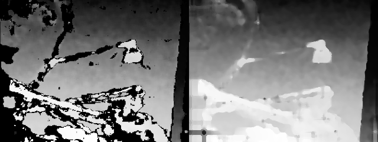
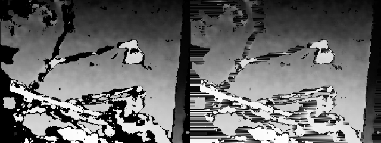

Disparity Map Inpainting
======

This project aims to develop, implement and evaluate an efficient algorithm for single disparity map inpainting in plain C.

Details
====

Input: 
  linearly adressed 8bit grayscale image (unsigned char*)
  it is assumed, that the pixels to be inpainted have value 0
  
Output: 
  inplace processing
  all masked pixels (a.k.a. holes) should now have meaningful values assigned

Timeline
====

1. I first tried linear interpolation in both horizontal and vertical scanlines as suggested by Daniel Gurdan.
Just the horizontal interpolation showed a major problem:
The edges of the input are noisy.
More concretely they show a 1-pixel anti-aliased border.
This falsifies the start and end point values of hole-line-segments, which in turn leads incorrectly interpolated to stripes all over the place.

I also tried using different offsets beyond the initial start/end points and also different thresholds which decides when a pixel is overwritten and when not. No big breakthrough there.

2. I thought about a different approach and came up with layered flood filling.
The assumption was, that measurement errors occur at consistent depth planes.
I.e. a hole containing a foreground object (bright) probably could be this very object itself.
Also note, that obviously foreground overlays background (see implementation).
This resulted in the following.

The problem was, that this approach yields - as had to be expected - large constant areas, in contrast to the smooth interpolated regions we want.
So, next try.

3. I took a closer look at the input image and only then discovered the constant width of 1-pixel for the anti-aliasing effect. I thought, that probably the vertical and horizontal lines could complement each other - which of course is not the case but wasn't clear to me at the time. So, vertical interpolation implemented. One gets the final image by merging the horizontal and vertical result. I tried two versions, averaging (left) and maxing (right), the latter taking the brighter color for each pixel.

Better, but still same problem.

4. Ok, so to the hell with those edges. Let's do something about them.
I implemented an edge sharpening method specifically for my scenario. It looks for pixel adjacent to holes and assigns them the brightes value in their neighbourhood, effectively eliminating the anti-aliasing. Nice. While I first implemented only 4-way-neighbourhoods, 8-way is necessary for the wanted results.

5. Back to the linear interpolation, but this time on the preprocessed input image.

Nice, but could be better. Looks like a pretty good case for

6. Median filters. For now, I use the opencv implementation. I thought this could be the most time-consuming part, however, I found a paper introcuding an O(1) (in kernel size) median filter, which looks promissing. Will implement it in C when I have some time.
Here the currently final result:

Attributions
====

All files in paper/ are there for convenience only.
I take no credit whatsoever.

- S. Perreault, P. Hébert - Median Filtering in Constant Time.pdf
Published in the September 2007 issue of IEEE Transactions on Image Processing.
https://nomis80.org/ctmf.html
